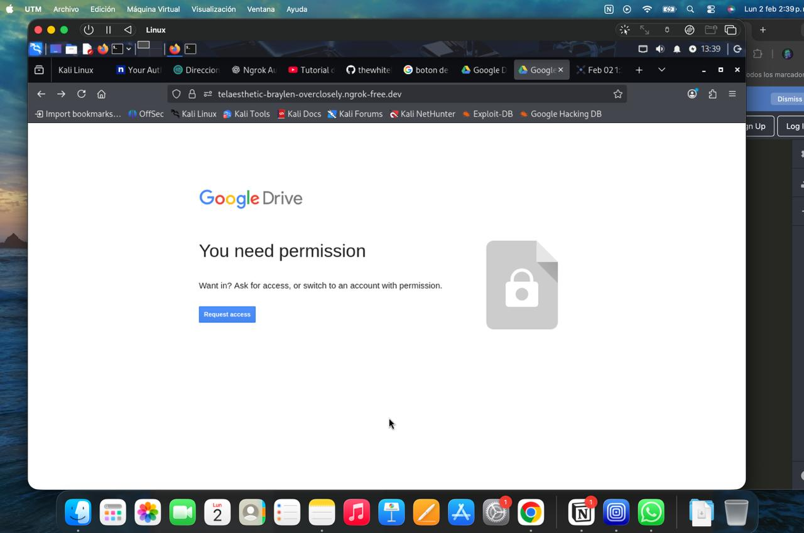

# Proyecto de Hacking Ético

## Entorno de trabajo

Este repositorio presenta un análisis educativo sobre los riesgos de seguridad y privacidad asociados al uso indebido de permisos de geolocalización en aplicaciones y sitios web, desde un enfoque de hacking ético y concientización en ciberseguridad.

## ¿Por qué se desarrolló?

El proyecto se basa en el estudio de una prueba de concepto (PoC) que demuestra cómo un sitio web malicioso puede recolectar información sensible únicamente si el usuario otorga permisos explícitos, resaltando la importancia de no aceptar permisos sin verificar la legitimidad del sitio.

## Herramienta Analizada

La herramienta estudiada es Seeker, un proyecto de código abierto que funciona como prueba de concepto, demostrando qué tipo de información puede ser recolectada por un sitio web si un usuario acepta permisos de ubicación.

Tipo de información que puede exponerse (con consentimiento del usuario):

- Latitud y longitud aproximada
- Información del dispositivo y navegador
- Dirección IP pública
- Datos generales del sistema

Nota: La herramienta no explota vulnerabilidades; depende totalmente de la acción del usuario.

## Descripción del proyecto

El proyecto consiste en una demostración controlada ejecutada en un entorno seguro y aislado. Al generar un enlace mediante Seeker y compartirlo, cuando el usuario accede y acepta los permisos de ubicación que el navegador solicita, el sistema registra de forma automática información asociada a esa conexión. Todo el proceso se llevó a cabo con fines estrictamente educativos, sin intervención en sistemas ajenos ni recolección de datos reales de terceros.

Entre los datos observados durante la prueba se incluyen:

- Dirección IP pública
- Tipo de sistema operativo
- Navegador utilizado
- Información geográfica aproximada (país, región o ciudad)
- Coordenadas de ubicación (solo si el usuario acepta el permiso del navegador)

La precisión de los datos varía según el dispositivo y la configuración del usuario. La información geográfica es estimada y no representa una localización exacta en todos los casos.

## Objetivos

- Comprender cómo funcionan los permisos de navegador y qué información exponen.
- Estudiar el comportamiento de herramientas de reconocimiento pasivo basadas en consentimiento del usuario.
- Analizar el alcance y las limitaciones de la información visible en una conexión web.
- Identificar riesgos reales relacionados con la aceptación indiscriminada de permisos en sitios desconocidos.
- Promover la concientización sobre privacidad y seguridad digital.
- Aplicar principios de hacking ético en entornos controlados y con fines de aprendizaje.

## Consideraciones éticas y legales

- El proyecto tiene fines exclusivamente académicos y de aprendizaje.
- Todas las pruebas fueron realizadas en entornos controlados con consentimiento.
- No se realizaron ataques, intrusiones ni accesos no autorizados a sistemas de terceros.
- No se recopiló información sensible ni datos personales de personas ajenas al proyecto.
- El uso de herramientas como Seeker fuera de un entorno ético y legal puede constituir una infracción. Este proyecto no promueve ni justifica su uso malicioso.

## Tecnologías utilizadas

- Linux
- Kali Linux
- Ngrok
- Máquina virtual

## Evidencia del laboratorio

### Evidencia 2

## Autor

Carlos Andre Hinostroza Altamirano  
Fines de aprendizaje
